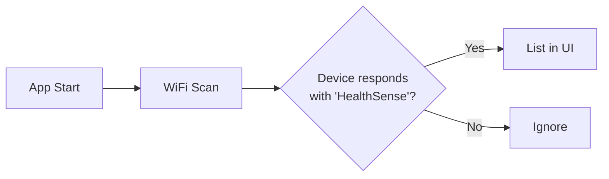
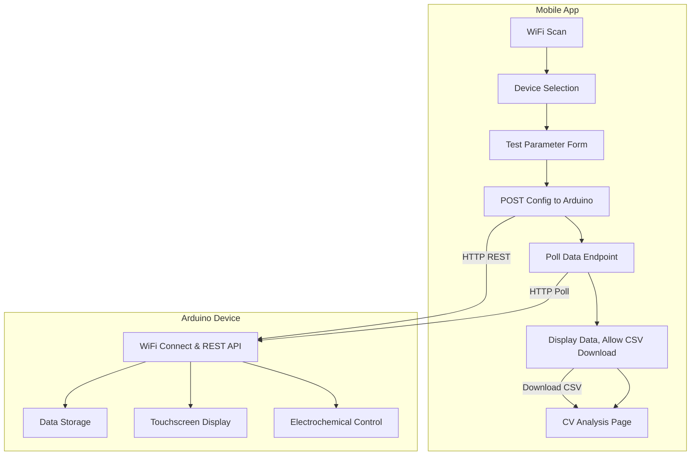

# HealthSense : Portable WiFi Potentiostat & Data Analysis Suite

HealthSense is an open hardware and software platform for portable electrochemical biosensing. It features a **WiFi-enabled Arduino-based potentiostat** and a **Flutter mobile app** for wireless control, data acquisition, and analysis. The platform enables Cyclic Voltammetry (CV), Differential Pulse Voltammetry (DPV), and Amperometry, supporting both general electrochemical research and analyte-specific diagnostics.

---

## Table of Contents

- [Features](#features)
- [System Overview](#system-overview)
- [User Workflows](#user-workflows)
  - [Device Discovery](#device-discovery)
  - [Test Configuration and Execution](#test-configuration-and-execution)
  - [Real-time Data Streaming](#real-time-data-streaming)
  - [Results Dashboard & CSV Download](#results-dashboard--csv-download)
  - [Analyte Testing](#analyte-testing)
  - [CV Data Analysis (App-only)](#cv-data-analysis-app-only)
- [Architecture](#architecture)
- [Screenshots](#screenshots)
- [File Structure](#file-structure)
- [Setup and Installation](#setup-and-installation)
  - [Arduino Firmware](#arduino-firmware)
  - [Mobile App](#mobile-app)
- [REST API Reference](#rest-api-reference)
- [Extending and Customizing](#extending-and-customizing)
- [Troubleshooting](#troubleshooting)
- [Contributing](#contributing)
- [License](#license)
- [Acknowledgements](#acknowledgements)

---

## Features

- **WiFi Device Discovery:**  
  Automatically scans and lists available HealthSense devices on the local network.

- **No Authentication:**  
  The app is open-access on the local network, with no login or user accounts.

- **Flexible Test Configuration:**  
  Set test parameters for CV, DPV, and amperometry, including voltage ranges, step sizes, and timings.

- **Real-Time Data Streaming:**  
  Live stream of raw data points from Arduino to app. Data is displayed as a scrollable list.

- **Results Dashboard:**  
  For each test, view results in-app and download as CSV for further analysis.

- **Analyte Testing:**  
  Select from built-in analytes (e.g., glucose, uric acid). Reference ranges are shown in the dashboard, and test results are interpreted as normal or abnormal.

- **Offline CV Data Analysis:**  
  Analyze downloaded CSVs directly in the app:  
  - Visualize CV curves  
  - Perform linear regression  
  - Estimate electrochemical properties  
  - No Arduino required for this analysis

- **Arduino Touchscreen Graphs:**  
  Live plotting and user interaction are available on the device touchscreen for local monitoring.

- **Extensible REST API:**  
  Easily extend the Arduino firmware to add new endpoints or analytes.

- **Documentation & Developer Tools:**  
  Comprehensive API and workflow documentation.

---

## System Overview

HealthSense consists of two main components:

1. **Arduino-based Potentiostat:**  
   - Connects to WiFi and exposes a REST API
   - Controls the electrochemical cell
   - Displays real-time graphs and status on touchscreen

2. **Flutter Mobile App:**  
   - Discovers HealthSense devices on the network
   - Configures and starts electrochemical tests
   - Streams and displays data, allows CSV download
   - Analyzes CSV files offline

### Typical User Flow

1. Power on Arduino (HealthSense device)
2. Open HealthSense app on phone/tablet (same WiFi)
3. Scan for and connect to device
4. Configure and run test (CV, DPV, amperometry, or analyte)
5. Stream and optionally save data
6. (Optional) Analyze CSV data in app

---

## User Workflows

### Device Discovery

- The app pings all IPs on the local network for `/whoami`.
- Devices identifying as "HealthSense" are listed for selection.



### Test Configuration and Execution

- User selects a test mode (CV, DPV, amperometry) or analyte.
- Presents a form for relevant parameters (e.g., start/stop voltage, scan rate, step size).
- On submit, sends an HTTP POST to the Arduino.

#### Example CV Parameters

| Parameter     | Description         | Example Value |
|---------------|--------------------|--------------|
| Start Voltage | Initial voltage    | -0.5 V       |
| End Voltage   | Final voltage      | 0.6 V        |
| Step Size     | Voltage increment  | 0.01 V       |
| Scan Rate     | Speed of sweep     | 50 mV/s      |

### Real-time Data Streaming

- The app polls the Arduino's `/cvdata`, `/dpvdata`, or `/ampdata` endpoint at 100ms intervals.
- Each response contains the latest data point (`x`, `y` for CV/DPV; `t`, `i` for amperometry).
- Data is displayed in a scrollable list; auto-scrolls to latest.

### Results Dashboard & CSV Download

- When the test completes, the app fetches the final result (`/result`).
- For analytes, the dashboard interprets the value based on reference ranges.
- User can download all streamed data as a CSV file (with optional metadata, e.g., concentration for CV).

### Analyte Testing

- User selects from built-in analyte options (see `analyte_dashboard.dart`).
- App sends a request; Arduino executes the appropriate test routine.
- Results are fetched and interpreted as "normal" or "abnormal" based on min/max reference.

### CV Data Analysis (App-only)

- In the app, the user can load a CSV from device storage.
- Data is parsed and shown as a graph (CV curve).
- User can select sections for linear regression to estimate parameters (e.g., slope, y-intercept).
- All analysis is local; Arduino is not involved.

---

## Architecture



---

## Screenshots

_(Insert screenshots of key app pages: WiFi scan, test config, data stream, results dashboard, analyte page, CV analysis page)_  
_(Insert photo of Arduino device with touchscreen running a test)_

---

## File Structure

```
bio-amp/
├── arduino/
│   └── HealthSense.ino          # Arduino firmware
├── lib/                    # Flutter app source
│   ├── main.dart           # Entry point
│   ├── wifi_scan_page.dart # Device discovery
│   ├── volt_config_page.dart
│   ├── dpv_config_page.dart
│   ├── amp_config_page.dart
│   ├── volt_dashboard.dart # Data streaming/results UI
│   ├── analyte_dashboard.dart
│   ├── cv_analysis_page.dart # CSV analysis & regression
│   ├── ... (other UI components)
├── README.md
├── pubspec.yaml
└── ...
```

---

## Setup and Installation

### Arduino Firmware

1. **Hardware:**  
   - Assemble the HealthSense circuit with Arduino (see schematic in `docs/`).
   - Attach touchscreen (if available).

2. **Libraries:**  
   - Install required Arduino libraries:  
     - WiFiNINA / ESP32 WiFi
     - Adafruit GFX (for touchscreen)
     - ArduinoJson

3. **Upload:**  
   - Open `arduino/HealthSense.ino` in Arduino IDE.
   - Configure WiFi credentials in the sketch.
   - Upload to your board.

4. **Network:**  
   - Ensure the Arduino and your mobile device are on the same local WiFi.

### Mobile App

1. **Requirements:**  
   - Flutter SDK (>= 3.0)
   - Android or iOS device on same WiFi

2. **Installation:**  
   ```sh
   git clone https://github.com/Shash976/bio-amp.git
   cd bio-amp
   flutter pub get
   flutter run
   ```

3. **Permissions:**  
   - Allow local network access if prompted.

---

## REST API Reference

The Arduino exposes a REST API for all control and data actions.

| Endpoint           | Method | Description                          | Payload/Params                 |
|--------------------|--------|--------------------------------------|--------------------------------|
| `/whoami`          | GET    | Identify device                      | —                              |
| `/cv`              | POST   | Start CV test                        | JSON params                    |
| `/dpv`             | POST   | Start DPV test                       | JSON params                    |
| `/amp`             | POST   | Start amperometry                    | JSON params                    |
| `/cvdata`          | GET    | Get latest CV data point             | —                              |
| `/dpvdata`         | GET    | Get latest DPV data point            | —                              |
| `/ampdata`         | GET    | Get latest amperometry data point    | —                              |
| `/result`          | GET    | Get final result                     | —                              |
| `/analyte`         | POST   | Start analyte-specific test          | analyte name                   |

#### Example: Start CV Test

```json
POST /cv
{
  "start_voltage": -0.5,
  "end_voltage": 0.6,
  "step_size": 0.01,
  "scan_rate": 50
}
```

#### Example: Poll Data

```http
GET /cvdata
Response: { "x": 0.03, "y": 1.24 }
```

---

## Extending and Customizing

- **Add New Analytes:**  
  - Edit firmware to support new routines or reference ranges.
  - Update `analyte_dashboard.dart` in the app for new UI options.

- **Change Test Modes:**  
  - Add new endpoints and UI forms for new voltammetry techniques.

- **Customize Analysis:**  
  - Modify `cv_analysis_page.dart` to add more statistical or graphical tools.

---

## Troubleshooting

- **Device not found:**  
  - Double-check WiFi connection and power.
  - Ensure both devices are on the same subnet.
  - Check for firewall/router blocking.

- **App issues:**  
  - Run `flutter doctor` and resolve warnings.
  - Check app permissions for network access.

- **Firmware issues:**  
  - Monitor serial output for errors.
  - Ensure all Arduino libraries are installed.

---

## Contributing

1. Fork the repository
2. Create a feature branch
3. Commit and push your changes
4. Submit a Pull Request—describe your changes and link to the relevant issues

---

## License

MIT License

---

## Acknowledgements

HealthSense is inspired by open hardware projects in the biosensing and DIY potentiostat community. Special thanks to contributors, testers, and the open-source Flutter and Arduino communities.

---

_For full commit history and updates, see [GitHub Commits](https://github.com/Shash976/bio-amp/commits/main)_
